<div align="center">



# <picture><source media="(prefers-color-scheme: dark)" srcset="https://api.iconify.design/solar:test-tube-linear.svg?color=%2300F2FE"><source media="(prefers-color-scheme: light)" srcset="https://api.iconify.design/solar:test-tube-linear.svg?color=%230969DA"></picture> LABORATORY SAFETY & OPERATING PROTOCOLS
### **Standard Operating Procedures (SOP) for Chemical, Environmental & Catalysis Laboratories**

[](#)
[](#)
[-D97706?style=for-the-badge&logo=cnet&logoColor=white)](#)
[](#)

<br/>

<table>
  <tr>
    <td align="center"><b>Document ID:</b> SOP-LAB-2026</td>
    <td align="center"><b>Target Audience:</b> Researchers, M.Sc. & Ph.D. Analysts</td>
    <td align="center"><b>Review Cycle:</b> Bi-Annual</td>
  </tr>
</table>

<p align="center">
  <b>This repository outlines mandatory environmental and chemical laboratory safety rules, waste disposal workflows, and emergency response guidelines to ensure personal safety and experimental integrity.</b>
</p>

</div>

---

> [!CAUTION]
> **MANDATORY ENTRANCE POLICY**  
> No personnel may enter the laboratory or operate diagnostic equipment without completing standard HSE safety training, wearing appropriate Personal Protective Equipment (PPE), and receiving supervisor authorization.

---

## <picture><source media="(prefers-color-scheme: dark)" srcset="https://api.iconify.design/solar:shield-check-linear.svg?color=%2300F2FE"><source media="(prefers-color-scheme: light)" srcset="https://api.iconify.design/solar:shield-check-linear.svg?color=%230969DA"></picture> 1. PERSONAL PROTECTIVE EQUIPMENT (PPE) CHECKLIST

All personnel must verify that their attire complies with safety guidelines before crossing the laboratory threshold. Use the checklist below prior to initiating wet-lab synthesis or handling reagents:

- [ ] **Eye Protection:** ANSI Z87.1 approved safety goggles or full-face shields must be worn at all times when handling liquid acids, bases, or volatile organic compounds.
- [ ] **Lab Coat:** A full-length, buttoned, flame-resistant laboratory coat is strictly required.
- [ ] **Hand Protection:** Nitrile or specialized chemical-resistant gloves selected according to the specific solvent or reagent compatibility chart.
- [ ] **Footwear:** Fully closed-toe, non-porous, slip-resistant shoes. Mesh weaving, sandals, or perforated footwear are strictly prohibited.
- [ ] **Personal Grooming:** Long hair must be securely tied back; dangling jewelry, loose sleeves, and lanyards must be removed or tucked away.

---

## <picture><source media="(prefers-color-scheme: dark)" srcset="https://api.iconify.design/solar:clipboard-list-linear.svg?color=%2300F2FE"><source media="(prefers-color-scheme: light)" srcset="https://api.iconify.design/solar:clipboard-list-linear.svg?color=%230969DA"></picture> 2. CORE OPERATING PRINCIPLES

<div align="center">

| Rule # | Protocol Name | Operational Guidelines |
| :---: | :--- | :--- |
| **01** | ** The Two-Person Rule** | Never conduct hazardous chemical synthesis, high-temperature calcination, or pressurized reactions alone in the facility. |
| **02** | ** Fume Hood Operation** | All procedures involving volatile solvents, toxic vapors, or concentrated acids must be executed inside a certified fume hood with the sash kept below the safety line. |
| **03** | ** Reagent Labeling** | Every beaker, vial, or flask must be immediately labeled with the chemical name, concentration, date, and researcher initials. **Unlabeled containers will be confiscated and disposed of as hazardous waste.** |
| **04** | ** Zero Ingestion Policy** | Eating, drinking, applying cosmetics, or storing food and beverages within the laboratory refrigerator or bench space is strictly forbidden. |

</div>

---

> [!IMPORTANT]
> **CHEMICAL STORAGE COMPATIBILITY**  
> Always separate chemicals by reactive class—not alphabetically. Ensure oxidizers are isolated from organics, and acids are strictly segregated from bases and active metals.

---

## <picture><source media="(prefers-color-scheme: dark)" srcset="https://api.iconify.design/solar:trash-bin-trash-linear.svg?color=%2300F2FE"><source media="(prefers-color-scheme: light)" srcset="https://api.iconify.design/solar:trash-bin-trash-linear.svg?color=%230969DA"></picture> 3. CHEMICAL WASTE & DISPOSAL WORKFLOWS

Improper disposal of reaction byproducts compromises environmental safety and violates municipal waste regulations. Follow the designated disposal matrix:

```yaml
🔴 HAZARDOUS CHEMICAL WASTE:
  ▪ Halogenated Solvents     → Dispose in RED labeled polyethylene carboys ONLY.
  ▪ Non-Halogenated Solvents → Dispose in BLUE labeled carboys (e.g., Ethanol, Acetone, Hexane).
  ▪ Heavy Metal / Catalysts  → Collect solid catalyst residues in dedicated heavy-metal solid waste jars.

🟡 SPECIALIZED & BIO-WASTE:
  ▪ Waste Cooking Oils / Bio-feedstocks → Store in sealed, secondary-contained drums labeled "Oil Recovery".
  ▪ Sharps & Glassware                 → Dispose of broken beakers, pipettes, and needles EXCLUSIVELY in puncture-proof sharps containers.

🟢 GENERAL NON-HAZARDOUS WASTE:
  ▪ Uncontaminated paper towels, glove wrappers, and general office trash go into standard municipal bins.
